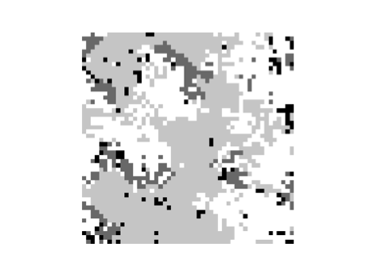
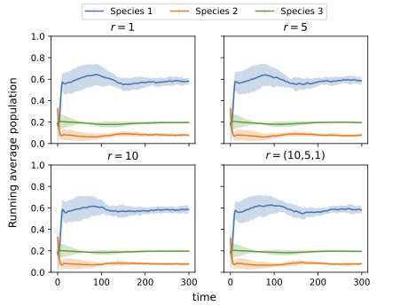

# Equilibrium States In A Three-Agent Predator-Prey System
This repo implements a predator-prey cellular automata. The code allows for studying different setups by varying parameters such as:
- number of agents
- grid size
- length of sight
- birth/death probabilities
- density of (sight-blocking) trees 

## Paper
In this [paper](report.pdf), a three-level Predator-Prey Cellular Automaton (CA) is studied. The system was
made up of a chain of one low-level prey that could be eaten by the second-level species which in
turn could be eaten by the top-level predator. A parameter study was conducted to understand
how different parameters affect the stability and equilibrium states of the system.
It was shown that varying the creatures' length of sight did not affect the stability. However,
introducing environmental structure (i.e. trees) was shown to affect the steady state. In one case
the low-level prey was seen to increase its steady-state population by 2.6 times that without
trees.

